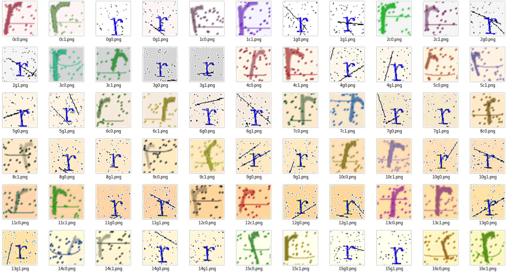
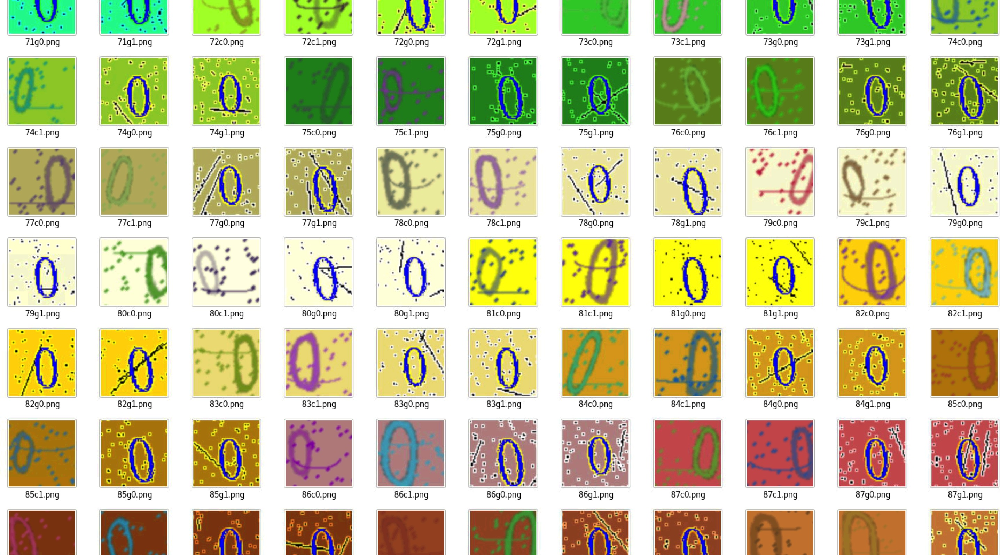
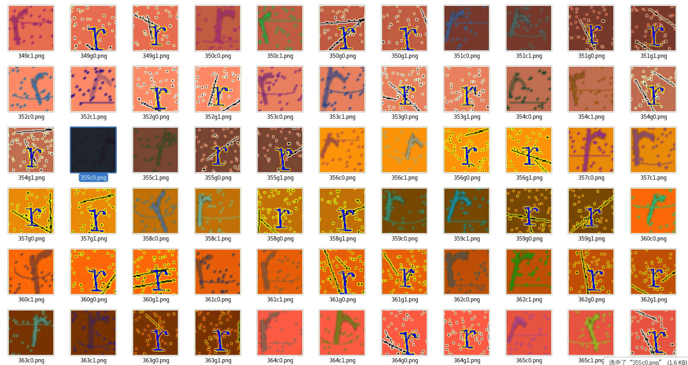

# dataset

> 君思的数据集，赶快收藏吧

----

## 验证码数据集（原创）

<table style="width:100%">
  <tr>
    <td>
      
    </td>
    <td align="center">
        
    </td>
    <td>
      
    </td>
  </tr>
</table>

> 如果做了模型请私信我，挂链接

* [40w验证码数据集 大小1G](https://pan.baidu.com/s/1GLgRamvXCM0VVLfhkJzQqA) 密码:7tfs

| name | 标签合计 | 总数合计 |
| :- | :- | :- |
| 训练集 | 1600 | 131200 |
| 验证集 | 1600 | 131200 |
| 测试集 | 1600 | 131200 |
| 标签 | | 82 |
| 统计 | | 393600 |

* [3w验证码轻量数据集 大小50M](https://pan.baidu.com/s/1En4AaxMzMQTkmRGu2P1sJw) 密码:drve

| name | 标签合计 | 总数合计 |
| :- | :- | :- |
| 训练集 | 120 | 9840 |
| 验证集 | 120 | 9840 |
| 测试集 | 120 | 9840 |
| 标签 | | 82 |
| 统计 | | 29520 |

> 标签分类情况

```python
label = [
    '0', '1', '2', '3', '4', '5', '6', '7', '8', '9',
    'a', 'b', 'c', 'd', 'e', 'f', 'g', 'h', 'i', 'j', 'k', 'l', 'm', 'n', 'o', 'p', 'q', 'r', 's', 't', 'u', 'v',
    'w', 'x', 'y', 'z',
    'A', 'B', 'C', 'D', 'E', 'F', 'G', 'H', 'I', 'J', 'K', 'L', 'M', 'N', 'O', 'P', 'Q', 'R', 'S', 'T', 'U', 'V',
    'W', 'X', 'Y', 'Z',
    '!', '@', '#', '$', '%', '^', '&', '*', '(', ')', '+', '-', '=', '[', '{', ']', '}', '<', '>', '?'
]
```

> ImageFolder方式数据集加载（PyTorch）

```python
data_url = '数据集PATH'

image_datasets = {
    x: datasets.ImageFolder(
            os.path.join(data_url, x),
            self.data_transforms[x]
        ) for x in ['train', 'val']
    }
data_loader_train = DataLoader(
    self.image_datasets['train'], batch_size=32,
    shuffle=True, num_workers=16, pin_memory=True
)
data_loader_val = DataLoader(
    self.image_datasets['val'], batch_size=32,
    shuffle=True, num_workers=16, pin_memory=True
)

dataloaders = {
    'train': data_loader_train,
    'val': data_loader_val,
}

```


# 相关实现

* [作者本人实现code 识别率93+%](https://github.com/vdjango/DeepCaptcha)

